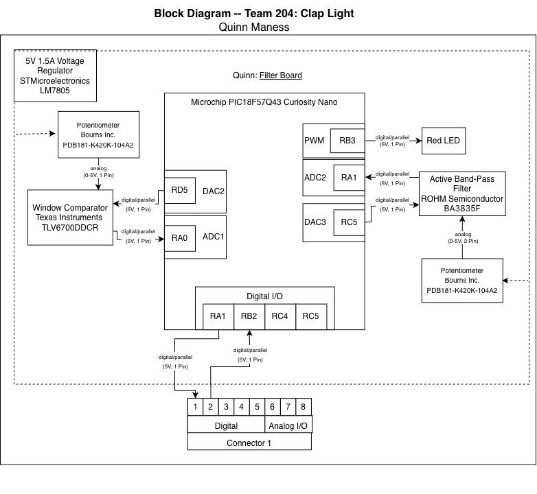

## Overview
The purpose of this block diagram is to get a basic visual representation of what my part for the team assignment will look like. It indicates the mechanism for creating the an adjustable frequency filter and an adjustable decibel filter all in one system. It also shows how many connections will be done as well as approximately where they will be on the board.

## Block Diagram 

