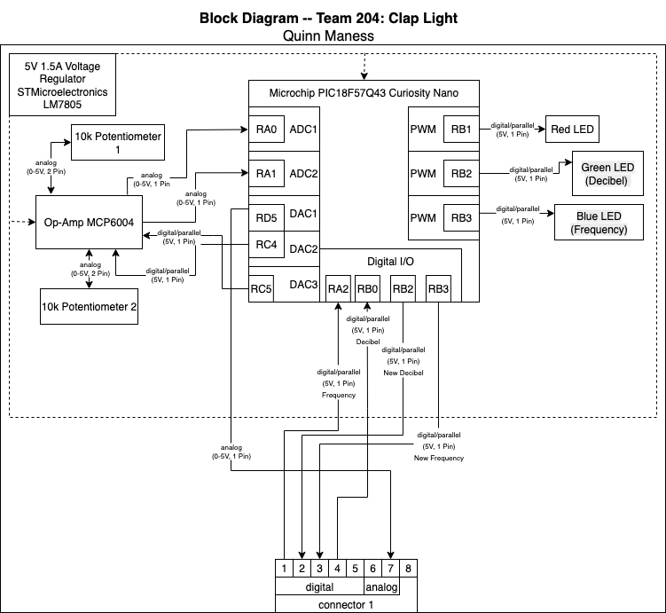

## Overview
The purpose of this block diagram is to get a visual representation of what my part for the team assignment might look like. It indicates the mechanism for creating a frequency filter for both sound frequency and decibel level (allbeit in a simplified depiction). It also shows how many connections will be done as well as approximately where they will be on the board.

## Block Diagram 

