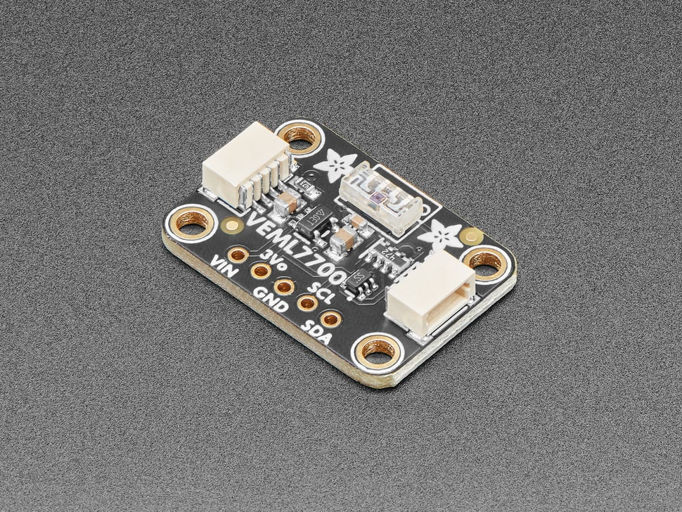
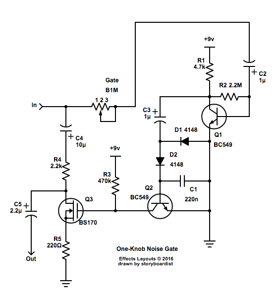
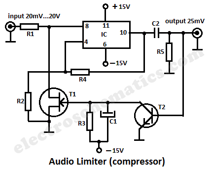
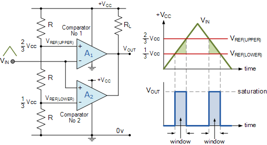
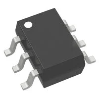
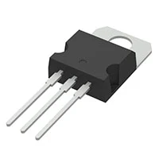
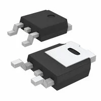

### Light Sensor

*Table 1: Light Sensor for Clap Light*

**Light Sensor**

| **Solution**                                                                                                                                                                                      | **Pros**                                                                                                                                    | **Cons**                                                                                            |
| ------------------------------------------------------------------------------------------------------------------------------------------------------------------------------------------------- | ------------------------------------------------------------------------------------------------------------------------------------------- | --------------------------------------------------------------------------------------------------- |
|   TEMT6000X01 $0.90/each [Link to product](https://www.mouser.com/ProductDetail/Vishay-Semiconductors/TEMT6000X01?qs=%2Fjqivxn91ccZGXDwz0wGxg%3D%3D&srsltid=AfmBOooQdB74AbB3cmws8rrGCeFrnCZulZ_kDPwcyoM4WwAIF_F-DG09)                 | \* Simple analog output \* Fast response and tiny footprint  \* Works directly with op-amp/ADC| \* Output is non-linear vs. lux \* Requires biasing and calibration  \* Sensitive to angle/spectrum|
|   BH1750FVI   $4.00/each   [Link to product](https://www.sunrom.com/p/digital-light-sensor-bh1750fvi?) | \* Reports lux directly via I²C  \* Minimal analog design | * Requires I²C + library  \* Fixed spectrum/transfer function  \* Module size > bare sensor                                                         |
|   Adafruit VEML7700 Lux Sensor - I2C Light Sensor - STEMMA QT / Qwiic $5.00/each [Link to product](https://www.adafruit.com/product/4162?srsltid=AfmBOorBHSPB9NFLJcU5ez7-J4arau8XeTmrqw6rngzxuV2-He8xyOAv)                 | \* Wide 0–120 klux, 16-bit  \* adjustable gain/integration  \* 3.3/5 V friendly and accurate lux output                                               | \* I²C interface required|

**Choice:** TEMT6000

**Rationale:** Since there is already an ADC channel, TEMT6000 keeps BOM cost and firmware complexity low while providing fast analog response. If calibrated, it’s sufficient for relative brightness feedback to the LED driver.

### Switch

*Table 2: Switch for Clap Light Sound Sensor Subsystem*

**Switch**

| **Solution**                                                                                                                                                                                      | **Pros**                                                                                                                                    | **Cons**                                                                                            |
| ------------------------------------------------------------------------------------------------------------------------------------------------------------------------------------------------- | ------------------------------------------------------------------------------------------------------------------------------------------- | --------------------------------------------------------------------------------------------------- |
|  Option 1  One-Knob Noise Gate  $1-10/each [Link to tutorial](https://effectslayouts.blogspot.com/2016/07/one-knob-noise-gate.html)                 | \* Highly adjustable \* Better control over characterisitics  \* Can meet surface mount constraint of project         | \* Requires large number of parts  \* Very complex  \* Requires power supply  \* Likely to be relatively large |
|   Option 2   Audio Limiter  \* $1-10/each  \* [Link to product](https://www.edn.com/audio-limiter-circuit-schematic/) | \* Less complex  \* Smaller than alternatives   \* Highly Adjustable | * Requires op-amp system  \* Would require a lot of innovation  \* Requires power supply |               
|   Option 3   Window Comparator Circuit  \* $1-10/each  \* [Link to tutorial](https://www.electronics-tutorials.ws/opamp/op-amp-comparator.html) | \* Easily applied  \* Recieves easily adjustable (with software) range of voltages   \* Doesn't filter (uses 'switch' instead) | * Requires extra innovation for easy user adjustabiity  \* More specific voltage/decibel range than other comparators \* Requires power supply  \* Requires op-amp  \* More complex than other comparators |
|   Option 4   TLV6700DDCR Window Comparator  \* $1.87/each  \* [Link to product](https://www.digikey.com/en/products/detail/texas-instruments/TLV6700DDCR/8635318) | \* Easily applied  \* Allows for adjustment of thresholds   \* Doesn't filter (uses 'switch' instead)  \* Wide range of voltage inputs| * Requires power supply  \* More complex than other comparators |

**Choice:** Option 4: TLV6700DDCR Window Comparator

**Rationale:** A window comparator is the best choice because it would allow for a more specific range of decibels in order to activate the switch--reducing accidental activation. It requires less innovation than a noise gate and limiter would, as neither of those are necessarily made for filtering decibel level in the same way that is required by a clap light. Although more complex than other comparators, it would allow for a more specific range of decibels to be the activation range, reducing accidental light activation. An already-created comparator system such as the TLV6700DDCR is also prefferable to a ciruit equivalent because it only necessitates 1 device, therefore streamlining creation and debugging.

### Voltage Regulator

*Table 3: Voltage Regulator for Filtering Subsystem*

**Voltage Regulator**

| **Solution**                                                                                                                                                                                      | **Pros**                                                                                                                                    | **Cons**                                                                                            |
| ------------------------------------------------------------------------------------------------------------------------------------------------------------------------------------------------- | ------------------------------------------------------------------------------------------------------------------------------------------- | --------------------------------------------------------------------------------------------------- |
|  Option 1  LM7805  $0.50/each [Link to product](https://www.digikey.com/en/products/detail/stmicroelectronics/L7805CV/585964)                 | \* Simple  \* Meets specifications for +5V voltage regulator  \* Typical current output is more than enough needed for system                                               | \* Can have problems with overheating  \* Might need heatsink system |
|   Option 2   LD1086DT50TR  \* $1.29/each  \* [Link to product](https://www.digikey.com/en/products/detail/stmicroelectronics/LD1086DT50TR/725468) | \* Current guaranteed until 1.5A (nearly 2 times what is needed)  \* Wide working temperature range   \* Very consistent voltage output | * Suffers from similar overheating issues as LM7805  \* Only outputs +5V  \* More efficient options |               

**Choice:** Option 1: LM7805

**Rationale:** The LM7805--while not as efficient as others and lacking impressive specifications--is perfectly capable of doing what is required by the filter subsystem. Considering that only +5V and a current of ~750mA is necessitated by the system, the specifications given by the LM7805 is more than enough. It must also be pointed out that, as students, we already have easy access to this voltage regulator. It's a simple choice, and the subsystem doesn't need a complex voltage regulator.

