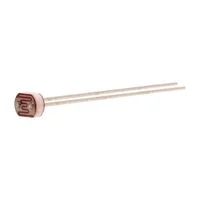

### Light Sensor

*Table 1: Light Sensor for Clap Light*

**Light Sensor**

| **Solution**                                                                                                                                                                                      | **Pros**                                                                                                                                    | **Cons**                                                                                            |
| ------------------------------------------------------------------------------------------------------------------------------------------------------------------------------------------------- | ------------------------------------------------------------------------------------------------------------------------------------------- | --------------------------------------------------------------------------------------------------- |
|   Option 1   TEMT6000X01 $0.90/each [Link to product](https://www.mouser.com/ProductDetail/Vishay-Semiconductors/TEMT6000X01?qs=%2Fjqivxn91ccZGXDwz0wGxg%3D%3D&srsltid=AfmBOooQdB74AbB3cmws8rrGCeFrnCZulZ_kDPwcyoM4WwAIF_F-DG09)                 | \* Simple analog output \* Fast response and tiny footprint  \* Works directly with op-amp/ADC| \* Output is non-linear vs. lux \* Requires biasing and calibration  \* Sensitive to angle/spectrum|
|   Option 2   BH1750FVI   $4.00/each   [Link to product](https://www.sunrom.com/p/digital-light-sensor-bh1750fvi?) | \* Reports lux directly via I²C  \* Minimal analog design | * Requires I²C + library  \* Fixed spectrum/transfer function  \* Module size > bare sensor                                                         |
|   Option 3   Adafruit VEML7700 Lux Sensor - I2C Light Sensor - STEMMA QT / Qwiic $5.00/each [Link to product](https://www.adafruit.com/product/4162?srsltid=AfmBOorBHSPB9NFLJcU5ez7-J4arau8XeTmrqw6rngzxuV2-He8xyOAv)                 | \* Wide 0–120 klux, 16-bit  \* adjustable gain/integration  \* 3.3/5 V friendly and accurate lux output                                               | \* I²C interface required|
|   Option 4   PDV-P5003 Photo-Resistor  $1.54/each [Link to product](https://www.digikey.com/en/products/detail/advanced-photonix/PDV-P5003/480601?gclsrc=aw.ds&gad_source=1&gad_campaignid=20232005509&gbraid=0AAAAADrbLlhkYAWNMNTozepAbTv2ccVwy&gclid=Cj0KCQiAq7HIBhDoARIsAOATDxBoWV_Mcap_0-JiqJw5yr9BXxVhOUe6OAGBLrxOzEh_MJes9yKxfcEaAtMhEALw_wcB)                 | \* Very simple and easy to use  \* Small footprint  \* Works directly with op-amp (we had a lab using a photoresistor| \* Has no function aside from resistor and light sensor  \* Less complex usability|

**Choice:** Option 4: PDV-P5003 Photo-Resistor

**Rationale:** The PDV-P5003 Photo-Resistor keeps BOM cost and firmware complexity low while providing fast analog response. It doesn't need to be calibrated in the same way as a phototransistor as is extremely simple and easy to adjust/use.

### Switch

*Table 2: Switch for Clap Light Sound Sensor Subsystem*

**Switch**

| **Solution**                                                                                                                                                                                      | **Pros**                                                                                                                                    | **Cons**                                                                                            |
| ------------------------------------------------------------------------------------------------------------------------------------------------------------------------------------------------- | ------------------------------------------------------------------------------------------------------------------------------------------- | --------------------------------------------------------------------------------------------------- |
|  Option 1  CST10T2CR ON/OFF Switch  $2.65/each [Link to Product](https://www.digikey.com/en/products/detail/cit-relay-and-switch/CST10T2CR/12503245)                 | \* Only on and off functions keep it simple  \* Characterisitics suit project  \* Durable and high speed         | \* Limited customization  \* Requires power supply|
|   Option 2   2449-ANT11SECQE-ND ON/ON Switch   \* $1.94/each  \* [Link to product](https://www.digikey.com/en/products/detail/cit-relay-and-switch/ANT11SECQE/12503336) | \* Very compact  \* Versatile due to ON/ON function   \* Can offer two different on modes | \* Would require two different on modes to be created  \* More complex |              

**Choice:** Option 1: CST10T2CR ON/OFF Switch

**Rationale:** A simple ON/OFF switch like the one offered by the CST10T2CR is perfectly fine in this application. Seeing as a switch isn't even neccesary (it goes beyond expectations), just having the option itself is more than enough. 

### Voltage Regulator

*Table 3: Voltage Regulator for Sound Sensor Subsystem*

**Voltage Regulator**

| **Solution**                                                                                                                                                                                      | **Pros**                                                                                                                                    | **Cons**                                                                                            |
| ------------------------------------------------------------------------------------------------------------------------------------------------------------------------------------------------- | ------------------------------------------------------------------------------------------------------------------------------------------- | --------------------------------------------------------------------------------------------------- |
|  Option 1  LM7805  $0.50/each [Link to product](https://www.digikey.com/en/products/detail/stmicroelectronics/L7805CV/585964)                 | \* Simple  \* Meets specifications for +5V voltage regulator  \* Typical current output is more than enough needed for system                                               | \* Can have problems with overheating  \* Might need heatsink system |
|   Option 2   LD1086DT50TR  \* $1.29/each  \* [Link to product](https://www.digikey.com/en/products/detail/stmicroelectronics/LD1086DT50TR/725468) | \* Current guaranteed until 1.5A (nearly 2 times what is needed)  \* Wide working temperature range   \* Very consistent voltage output | * Suffers from similar overheating issues as LM7805  \* Only outputs +5V  \* More efficient options |               

**Choice:** Option 1: LM7805

**Rationale:** The LM7805--while not as efficient as others and lacking impressive specifications--is perfectly capable of doing what is required by the subsystem. Considering that only +5V and a current of ~750mA is necessitated by the system, the specifications given by the LM7805 is more than enough. It must also be pointed out that, as students, we already have easy access to this voltage regulator. It's a simple choice, and the subsystem doesn't need a complex voltage regulator.

