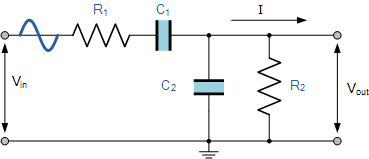

### Frequency Filter

*Table 1: Frequency Filter for Clap Light*

**Frequency Filter**

| **Solution**                                                                                                                                                                                      | **Pros**                                                                                                                                    | **Cons**                                                                                            |
| ------------------------------------------------------------------------------------------------------------------------------------------------------------------------------------------------- | ------------------------------------------------------------------------------------------------------------------------------------------- | --------------------------------------------------------------------------------------------------- |
|  Option 1  Active Band-Pass Filter  $1-10/each [Link to tutorial](https://www.electronics-tutorials.ws/filter/filter_7.html)                 | \* Highly adjustable \* Better control over filter characterisitics \* Can meet surface mount constraint of project                                               | \* Requires op-amp (or similar) system \* More complex  \* Requires power supply |
|   Option 2   BA3835F-E2 Active Band-Pass Filter \* $5.34/each  \* [Link to product](https://www.mouser.com/ProductDetail/ROHM-Semiconductor/BA3835F-E2?qs=IsRgwgmxh69SW0igeBnrlg%3D%3D) | \* Easier to work with  \* Compact   \* Easily repeatable and understood | * More expensive  \* Has unadjustable attributes  \* Requires power supply |               
|   Option 3   Passive Band-Pass Filter \* $1-10/each  \* [Link to tutorial](https://www.electronics-tutorials.ws/filter/filter_4.html) | \* No power supply needed  \* Simple   \* Easily repeatable and understood | * Less adjustable  \* Would require more innovation to apply  \* Requires power supply  \* Could end up being large and/or clunky |

**Choice:** Option 2: BA3835F-E2 Active Band-Pass Filter

**Rationale:** A widely made and used active band-pass filter is better in this application not only because it's smaller and requires less (unnecessary) innovation, but also because--in a real life scenario--it would allow for cheaper, more widely spread manufacturing of the clap light and its hardware/software.

### Decibel Filter

*Table 2: Decibel Filter for Clap Light*

**Decibel Filter**

| **Solution**                                                                                                                                                                                      | **Pros**                                                                                                                                    | **Cons**                                                                                            |
| ------------------------------------------------------------------------------------------------------------------------------------------------------------------------------------------------- | ------------------------------------------------------------------------------------------------------------------------------------------- | --------------------------------------------------------------------------------------------------- |
|  Option 1  One-Knob Noise Gate  $1-10/each [Link to tutorial](https://effectslayouts.blogspot.com/2016/07/one-knob-noise-gate.html)                 | \* Highly adjustable \* Better control over characterisitics  \* Can meet surface mount constraint of project         | \* Requires large number of parts  \* Very complex  \* Requires power supply  \* Likely to be relatively large |
|   Option 2   Audio Limiter  \* $1-10/each  \* [Link to product](https://www.edn.com/audio-limiter-circuit-schematic/) | \* Less complex  \* Smaller than alternatives   \* Highly Adjustable | * Requires op-amp system  \* Would require a lot of innovation  \* Requires power supply |               
|   Option 3   Window Comparator Circuit  \* $1-10/each  \* [Link to tutorial](https://www.electronics-tutorials.ws/opamp/op-amp-comparator.html) | \* Easily applied  \* Recieves easily adjustable (with software) range of voltages   \* Doesn't filter (uses 'switch' instead) | * Requires extra innovation for easy user adjustabiity  \* More specific voltage/decibel range than other comparators \* Requires power supply  \* Requires op-amp  \* More complex than other comparators |
|   Option 4   TLV6700DDCR Window Comparator  \* $1.87/each  \* [Link to product](https://www.digikey.com/en/products/detail/texas-instruments/TLV6700DDCR/8635318) | \* Easily applied  \* Allows for adjustment of thresholds   \* Doesn't filter (uses 'switch' instead)  \* Wide range of voltage inputs| * Requires power supply  \* More complex than other comparators |

**Choice:** Option 4: TLV6700DDCR Window Comparator

**Rationale:** A window comparator is the best choice because it would allow for a more specific range of decibels in order to activate the switch--reducing accidental activation. It requires less innovation than a noise gate and limiter would, as neither of those are necessarily made for filtering decibel level in the same way that is required by a clap light. Although more complex than other comparators, it would allow for a more specific range of decibels to be the activation range, reducing accidental light activation. An already-created comparator system such as the TLV6700DDCR is also prefferable to a ciruit equivalent because it only necessitates 1 device, therefore streamling creation and debugging.
