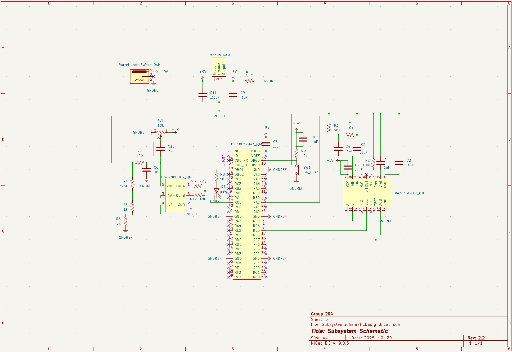

## Overview

This schematic is designed to support a system which takes an input audio frequency and decibel level and filters each separately so that only the frequency and decibel of a clap are output. Therefore, if the input sound was a clap, there will be values for both decibel level and frequency. Digital outputs will be determined by whether or not the filtered frequency and/or decibel give values. These outputs will be sent to the other team members' subsystems, which will then be used to determine whether or not to turn on the light (based on if the outputs indicate a clap).

{style width:"350" height:"300;"}
**Figure ##:** The subsystem including the window comparator system and the active band-pass filter.

## Resources

The schematic as a PDF download is available [*here*](SubsystemSchematicDesign2.3.pdf), and the Zip folder of the project [*here*](SubsystemSchematicDesign2.3.zip).
