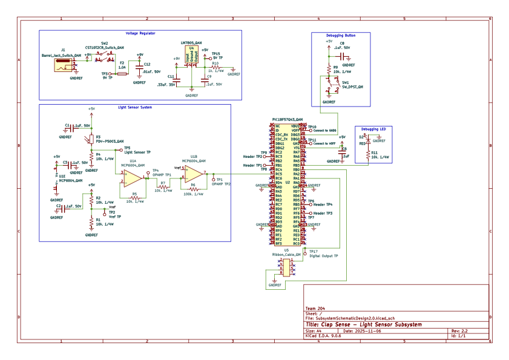

## Overview

This schematic is designed to support a system that utilizes a light sensor to determine whether or not the clap light being on is necessary or not. In a case where there's enough light in front of the sensor (placed away from the clap light), then the clap light will automatically be shut off to save power. Seeing as this system might not work with every individuals case--or they may not want this system in place--the subsystem also has an external switch to turn it on or off.

{style width:"350" height:"300;"}
**Figure ##:** The subsystem including the the light sensor, it's OPAMP system, the voltage regulator, debugging devices, and the ON/OFF switch.

## Resources

The schematic as a PDF download is available [*here*](SubsystemSchematicDesign2.0.pdf), and the Zip folder of the project [*here*](SubsystemSchematicDesign2.30.zip).
