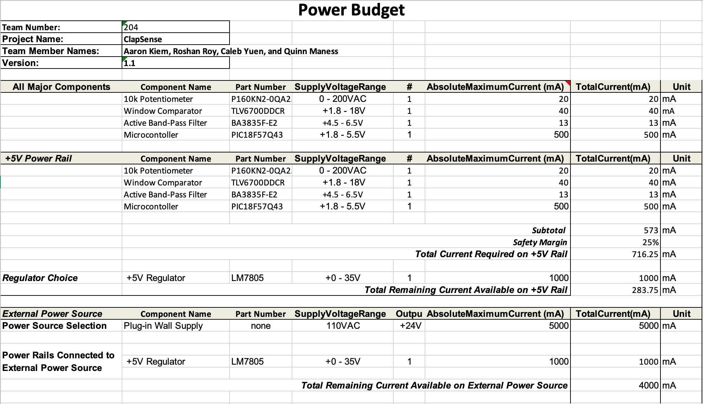

## Overview
Utilizing the specifications of each major component as given by their respective datasheets, I determined the power budget needed by my subsystem. This includes maximum current and voltage allowed by each component. Through acquiring these specifications, I was able to determine what voltage regulator and power source system would best fit within my subsystem. Knowing such is essential in order to prevent circuitry from becoming damaged due to high voltage or too much current.

{style width:"350" height:"300;"}

## Conclusions

From the power budget above, I was able to determine what voltage regulator to use, what power source to use, as well as a better understanding of how to go about making the circuits so as to prevent damage due to high voltage or current. This succinct and organized knowledge will help me use the correct resistors, capacitors, etc. for the subsystem I wish to implement.

## Resources

The power budget as a PDF download is available [*here*](PowerBudget1.1_QM.pdf), and a Microsoft Excel Sheet [*here*](PowerBudget1.1_QM.xlsx).
