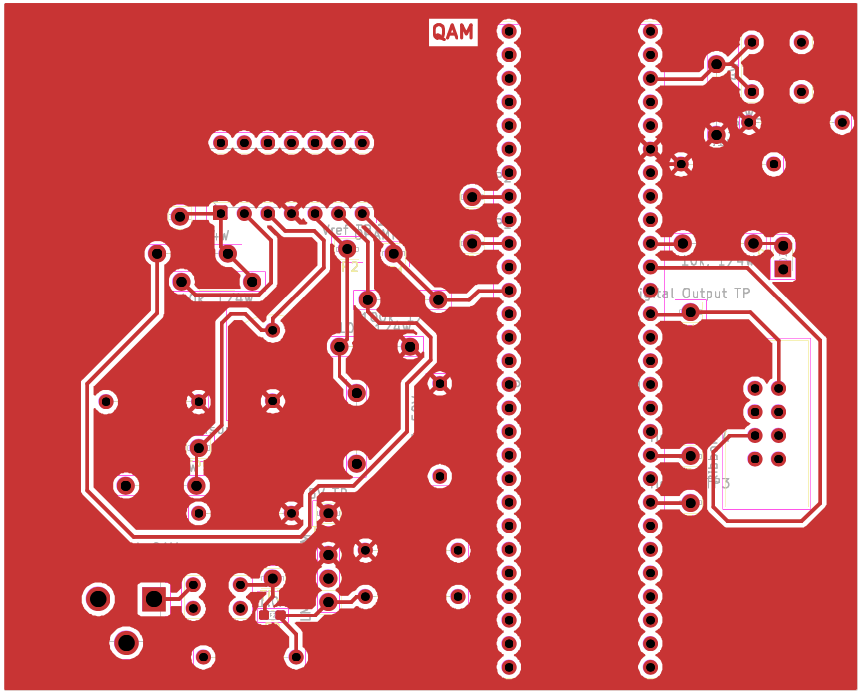
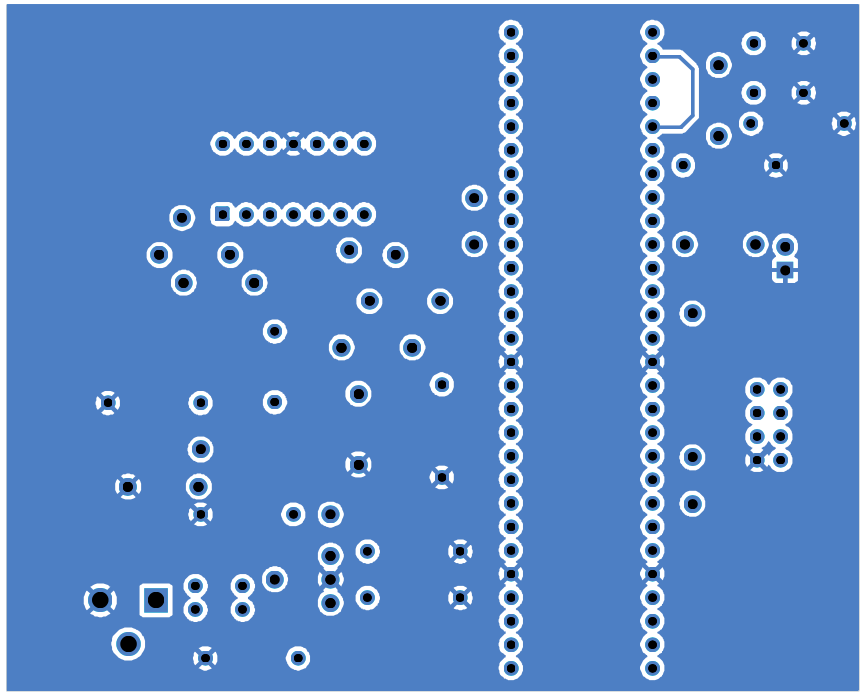

## Overview

Below are the front and back of the PCB design for the light sensor subsystem of the ClapSense clap light. [*Figure 1*](SubsystemPCBdesign.front.pdf) is the PCB, [*Figure 2*](SubsystemPCBdesign.front.pdf) is the front copper plate of the PCB, and [*Figure 3*](SubsystemPCBdesign.back.pdf) is the back copper plate of the PCB. Below the figures are resources such as the PDF versions of the figures, as well as the zip file for the subsystem created within Kicad.

{style width:"350" height:"300;"}
**Figure 1:** The subsystem PCB.

{style width:"350" height:"300;"}
**Figure 2:** The front of the subsystem PCB.

{style width:"350" height:"300;"}
**Figure 3:** The back of the subsystem PCB.

## Resources

The PCB front as a PDF download is available [*here*](SubsystemSchematicPCB.front.pdf).

The PCB back as a PDF download is available [*here*](SubsystemSchematicPCB.back.pdf).

The Zip file of the project [*here*](SubsystemSchematicDesign2.0.zip).

The Zip file containing the Gerber Files of the PCB [*here*](QuinnManess204.zip).
