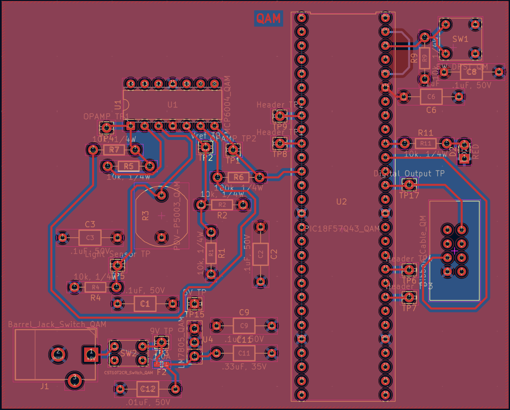

## Overview

Below are the main PCB, front copper plate, and the back plate of the PCB design for the light sensor subsystem of the ClapSense clap light. [*Figure 1*](SubsystemPCBdesign.pdf) is the PCB, [*Figure 2*](SubsystemPCBdesign.front.pdf) is the front copper plate of the PCB, and [*Figure 3*](SubsystemPCBdesign.back.pdf) is the back copper plate of the PCB. Below the figures are resources such as the PDF versions of the figures, as well as the zip files for the Gerber files of the PCB and the overall subsystem.

**Figure 1:** The subsystem PCB.
{style width:"350" height:"300;"}

**Figure 2:** The front of the subsystem PCB.
{style width:"350" height:"300;"}

**Figure 3:** The back of the subsystem PCB.
{style width:"350" height:"300;"}

## Resources

The PCB as a PDF download is available [*here*](SubsystemPCBdesign.pdf).

The PCB front plate as a PDF download is available [*here*](SubsystemPCBdesign.front.pdf).

The PCB back plate as a PDF download is available [*here*](SubsystemPCBdesign.back.pdf).

The Zip file of the project [*here*](SubsystemSchematicDesign2.0.zip).

The Zip file containing the Gerber Files of the PCB [*here*](QuinnManess204.#2.zip).
